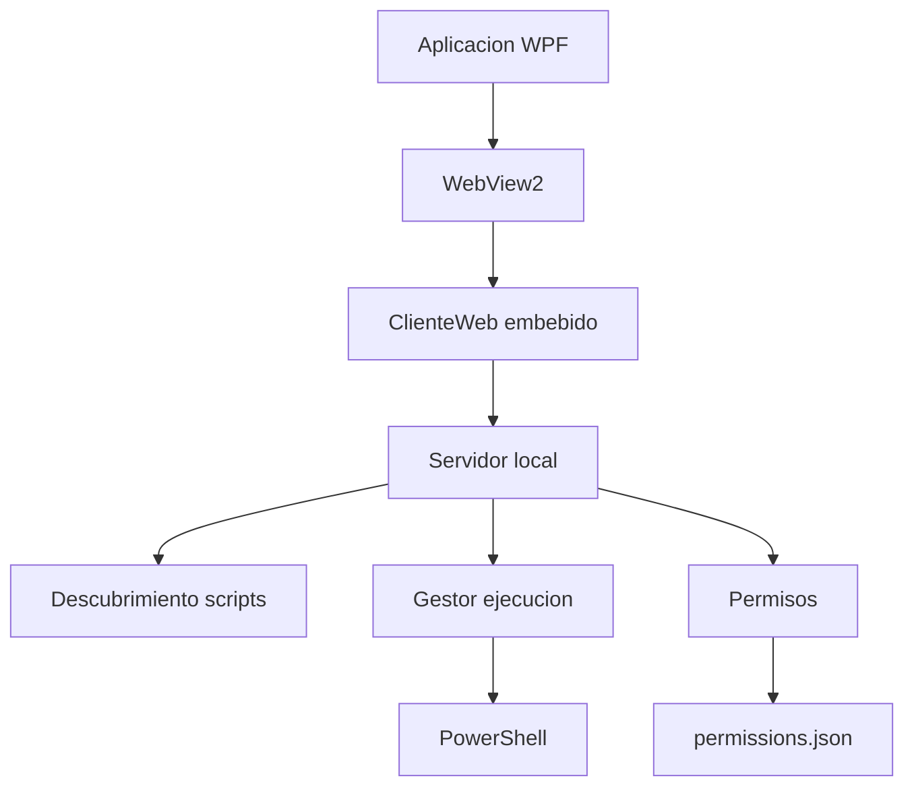

<!-- (Autor: Alex Roman) -->
<!-- Descripcion: Documentacion tecnica del lanzador de scripts PowerShell. -->

# LanzadorScripts

| Campo | Valor |
|---|---|
| Tipo | WPF + WebView2 |
| Runtime | .NET 10 Windows x64 |
| Uso | Descubrimiento y ejecucion controlada de scripts PowerShell |
| Backend | Servidor HTTP local interno |
| Configuracion | `%AppData%\LanzadorScripts\configuracion.json` |



## Rutas

| Recurso | Ruta |
|---|---|
| Config usuario | `%AppData%\LanzadorScripts\configuracion.json` |
| Config equipo | `C:\ProgramData\LanzadorScripts\configuracion.json` |
| Tokens admin | `%AppData%\LanzadorScripts\Tokens` |
| Logs | `%LocalAppData%\LanzadorScripts\Logs` |
| Auditoria | `%LocalAppData%\LanzadorScripts\Auditoria` |
| Perfil WebView2 | `%LocalAppData%\LanzadorScripts\WebView2` |

## Configuracion

```json
{
  "RutaScripts": "\\\\MAD002MICROPRU\\REPO",
  "RutaPermisos": "PERMISOS\\\\permissions.json",
  "RutaLogs": "%LocalAppData%\\\\LanzadorScripts\\\\Logs",
  "MaximoEjecucionesParalelas": 5
}
```

## Publicacion

```powershell
.\Herramientas\PublicarPortable.ps1
```

El script descarga el instalador oficial Evergreen Standalone x64 de WebView2 y lo embebe en el ejecutable publicado.

## Pruebas

```powershell
dotnet run --project .\Pruebas\LanzadorScripts.Pruebas.csproj
```

## Requisitos

| Requisito | Valor |
|---|---|
| SO | Windows 10/11 Pro o Enterprise |
| PowerShell | 5.1 |
| WebView2 | Runtime instalado o `publicacion\WebView2Runtime` |
| Permisos | Administrador local |
| Politicas | GPO/AppLocker/WDAC permitiendo app y `powershell.exe` |
