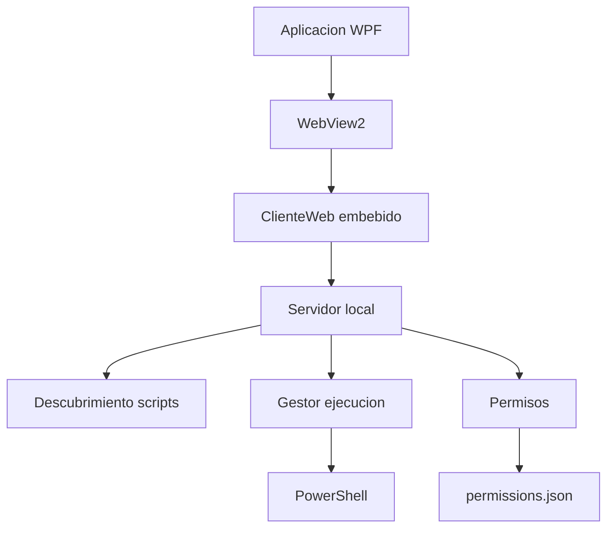

<!-- (Autor: Alex Roman) -->
<!-- Descripcion: Documentacion tecnica del lanzador de scripts PowerShell. -->

# LanzadorScripts

| Campo | Valor |
|---|---|
| Tipo | WPF + WebView2 |
| Runtime | .NET 10 Windows x64 |
| Uso | Descubrimiento y ejecucion controlada de scripts PowerShell |
| Backend | Servidor HTTP local interno |
| Configuracion | `%AppData%\LanzadorScripts\configuracion.dat` |



## Rutas

| Recurso | Ruta |
|---|---|
| Config usuario | `%AppData%\LanzadorScripts\configuracion.dat` |
| Config equipo | `C:\ProgramData\LanzadorScripts\configuracion.dat` |
| Tokens admin | `%AppData%\LanzadorScripts\Tokens` |
| Logs | `%LocalAppData%\LanzadorScripts\Logs` |
| Auditoria | `%LocalAppData%\LanzadorScripts\Auditoria` |
| Perfil WebView2 | `%LocalAppData%\LanzadorScripts\WebView2` |

## Configuracion

```json
{
  "RutaScripts": "\\\\MAD002MICROPRU\\REPO",
  "RutaPermisos": "PERMISOS\\\\permissions.json",
  "RutaLogs": "%LocalAppData%\\\\LanzadorScripts\\\\Logs",
  "MaximoEjecucionesParalelas": 5
}
```

## Publicacion

```powershell
.\Herramientas\PublicarPortable.ps1
```

El script descarga el instalador oficial Evergreen Standalone x64 de WebView2 y lo embebe en el ejecutable publicado.

El instalador WebView2 se valida por SHA-256 y firma Authenticode antes de compilar. Para firmar el EXE final, usar:

```powershell
.\Herramientas\PublicarPortable.ps1 -CertThumbprint "<THUMBPRINT>"
```

Tambien se puede usar `-CertPath` y `-CertPassword` con un certificado PFX. Si no se indica certificado, el script publica sin firmar y muestra un aviso.

El unico archivo distribuible para usuarios finales es `publicacion\LanzadorScripts.exe`. No se deben copiar los ejecutables generados en `bin\Debug` ni `bin\Release`, porque no representan el artefacto portable validado.

La publicacion final debe ser self-contained, single-file y x64. Si un equipo muestra un error de .NET Desktop Runtime faltante al abrir el portable, la publicacion no es valida o se esta ejecutando un binario incorrecto.

## Recuperacion WebView2

La aplicacion usa `%LocalAppData%\LanzadorScripts\WebView2` como perfil local de WebView2. Si el perfil falla durante el arranque, la aplicacion intenta recuperarlo automaticamente.

| Caso | Accion |
|---|---|
| Perfil recuperable | Renombra a `WebView2_Danado_yyyyMMdd_HHmmss` y crea un perfil limpio |
| Perfil bloqueado | Usa `WebView2_Recuperacion_yyyyMMdd_HHmmss` |
| Fallo de proceso Edge/WebView2 | Registra detalle en `%LocalAppData%\LanzadorScripts\Logs\arranque-yyyyMMdd.jsonl` |

Solo se conservan las ultimas 3 copias de diagnostico de perfiles dañados o de recuperacion.

## Seguridad de ejecucion

La API local exige cookie de sesion y token interno aleatorio por arranque. Los endpoints admin requieren siempre `Authorization: Bearer <token>`.

La politica de scripts vive en `permissions.json`:

```json
{
  "seguridadScripts": {
    "certificadosPowerShellPermitidos": [
      "THUMBPRINT_CERTIFICADO"
    ],
    "hashesBatchPermitidos": [
      {
        "scriptId": "carpeta/script.cmd",
        "sha256": "HASH_SHA256"
      }
    ],
    "permitirExecutionPolicyBypass": false
  }
}
```

La politica es fail closed. Los `.ps1` requieren firma Authenticode valida de un certificado permitido. Los `.bat` y `.cmd` requieren hash SHA-256 permitido. Los nombres y rutas relativas con `&`, `|`, `<`, `>`, `^`, `%` o `!` se rechazan.

El cambio de cifrado compartido queda aplazado. La clave AES fija usada por paquetes compartidos sigue documentada como riesgo aceptado hasta definir certificado corporativo o una politica de integridad separada.

## Pruebas

```powershell
dotnet run --project .\Pruebas\LanzadorScripts.Pruebas.csproj
```

## Requisitos

| Requisito | Valor |
|---|---|
| SO | Windows 10/11 Pro o Enterprise |
| PowerShell | 5.1 |
| WebView2 | Runtime instalado o instalador embebido en el EXE portable |
| Permisos | Administrador local |
| Politicas | GPO/AppLocker/WDAC permitiendo app y `powershell.exe` |
