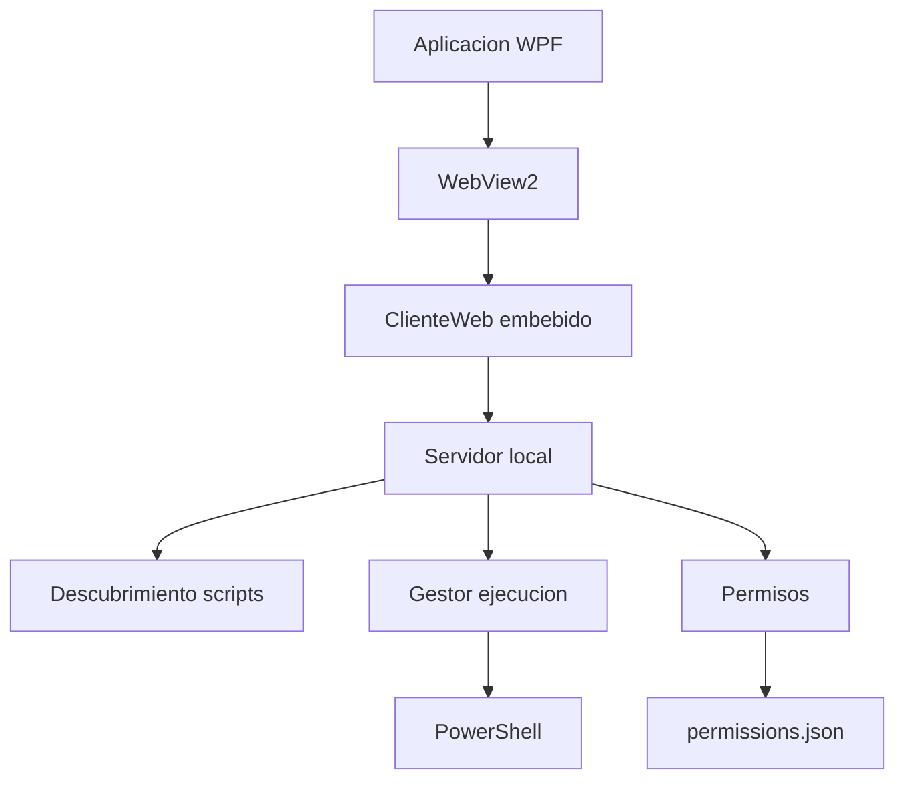

<!-- (Autor: Alex Roman) -->
<!-- Descripcion: Documentacion tecnica del lanzador de scripts PowerShell. -->

# LanzadorScripts

| Campo | Valor |
|---|---|
| Tipo | WPF + WebView2 |
| Runtime | .NET 10 Windows x64 |
| Uso | Descubrimiento y ejecucion controlada de scripts PowerShell |
| Backend | Servidor HTTP local interno |
| Configuracion | `%AppData%\LanzadorScripts\configuracion.dat` |


```mermaid
flowchart TD
    A[Aplicacion WPF] --> B[WebView2]
    B --> C[ClienteWeb embebido]
    C --> D[Servidor local]
    D --> E[Descubrimiento scripts]
    D --> F[Gestor ejecucion]
    D --> G[Permisos]
    F --> H[PowerShell]
    G --> I[permissions.json]
```

## Rutas

| Recurso | Ruta |
|---|---|
| Config usuario | `%AppData%\LanzadorScripts\configuracion.dat` |
| Config equipo | `C:\ProgramData\LanzadorScripts\configuracion.dat` |
| Tokens admin | `%AppData%\LanzadorScripts\Tokens` |
| Logs | `%LocalAppData%\LanzadorScripts\Logs` |
| Auditoria | `%LocalAppData%\LanzadorScripts\Auditoria` |
| Perfil WebView2 | `%LocalAppData%\LanzadorScripts\WebView2` |
| Staging ejecucion | `%LocalAppData%\LanzadorScripts\Staging` |

## Configuracion

```json
{
  "RutaScripts": "\\\\MAD002MICROPRU\\C$\\REPO",
  "RutaPermisos": "\\\\MAD002MICROPRU\\C$\\REPO\\PERMISOS\\permisos.json",
  "RutaLogs": "%LocalAppData%\\\\LanzadorScripts\\\\Logs",
  "MaximoEjecucionesParalelas": 5
}
```

Si una instalacion local quedo guardada con `\\MAD002MICROPRU\REPO`, la app la migra automaticamente a `\\MAD002MICROPRU\C$\REPO` al arrancar.

## Publicacion

```powershell
.\Herramientas\PublicarPortable.ps1 -CertThumbprint "<THUMBPRINT>"
```

El script descarga el instalador oficial Evergreen Standalone x64 de WebView2 y lo embebe en el ejecutable publicado.

El instalador WebView2 se valida por SHA-256 y firma Authenticode antes de compilar. Para firmar el EXE final, usar:

```powershell
.\Herramientas\PublicarPortable.ps1 -CertThumbprint "<THUMBPRINT>"
```

Tambien se puede usar `-CertPath` y `-CertPassword` con un certificado PFX. Si no se indica certificado, el script bloquea la publicacion salvo que se use `-AllowUnsignedForDev` para pruebas locales.

El unico archivo distribuible para usuarios finales es `publicacion\LanzadorScripts.exe`. No se deben copiar los ejecutables generados en `bin\Debug` ni `bin\Release`, porque no representan el artefacto portable validado.

La publicacion final debe ser self-contained, single-file y x64. Si un equipo muestra un error de .NET Desktop Runtime faltante al abrir el portable, la publicacion no es valida o se esta ejecutando un binario incorrecto.

El pipeline de GitHub exige firma Authenticode en `main` mediante los secretos `WINDOWS_SIGNING_CERT_BASE64` y `WINDOWS_SIGNING_CERT_PASSWORD`.

## Recuperacion WebView2

La aplicacion usa `%LocalAppData%\LanzadorScripts\WebView2` como perfil local de WebView2. Si el perfil falla durante el arranque, la aplicacion intenta recuperarlo automaticamente.

| Caso | Accion |
|---|---|
| Perfil recuperable | Renombra a `WebView2_Danado_yyyyMMdd_HHmmss` y crea un perfil limpio |
| Perfil bloqueado | Usa `WebView2_Recuperacion_yyyyMMdd_HHmmss` |
| Fallo de proceso Edge/WebView2 | Registra detalle en `%LocalAppData%\LanzadorScripts\Logs\arranque-yyyyMMdd.jsonl` |

Solo se conservan las ultimas 3 copias de diagnostico de perfiles dañados o de recuperacion.

## Seguridad de ejecucion

La API local exige cookie de sesion y token interno aleatorio por arranque. Los endpoints admin requieren siempre `Authorization: Bearer <token>`.

`permissions.json` debe estar firmado por el certificado corporativo. Si falta, esta corrupto o no es accesible, la aplicacion bloquea ejecuciones por defecto. La politica de scripts vive en `seguridadScripts`:

```json
{
  "seguridadScripts": {
    "certificadosPowerShellPermitidos": [
      "THUMBPRINT_CERTIFICADO"
    ],
    "hashesBatchPermitidos": [
      {
        "scriptId": "carpeta/script.cmd",
        "sha256": "HASH_SHA256"
      }
    ],
    "scriptsElevadosPermitidos": [
      "admin/script.ps1"
    ],
    "permitirExecutionPolicyBypass": false
  }
}
```

La politica es fail closed. Los `.ps1` requieren firma Authenticode valida de un certificado permitido. Los `.bat` y `.cmd` requieren hash SHA-256 permitido. Los nombres y rutas relativas con `&`, `|`, `<`, `>`, `^`, `%` o `!` se rechazan.

Los permisos y paquetes se protegen mediante firma asimetrica. DPAPI queda reservado para secretos locales. La aplicacion solicita administrador al iniciar y ejecuta los scripts desde el proceso principal elevado. El broker elevado queda como compatibilidad interna si alguna ejecucion futura se lanza sin elevacion.

El token maestro se firma con el certificado privado autorizado de Alex Roman. El mismo token puede reutilizarse mientras se conserve protegido y la firma sea valida; no requiere motivo operativo ni se registra como usado.

Antes de ejecutar, la aplicacion valida integridad, copia el script a staging local, aplica protecciones de archivo y revalida la copia para mitigar TOCTOU.

## Pruebas

```powershell
dotnet test .\Pruebas\LanzadorScripts.Pruebas.csproj
```

## Requisitos

| Requisito | Valor |
|---|---|
| SO | Windows 10/11 Pro o Enterprise |
| PowerShell | 5.1 |
| WebView2 | Runtime instalado o instalador embebido en el EXE portable |
| Permisos app | Administrador mediante `requireAdministrator` |
| Permisos elevados | Todos los scripts se ejecutan desde la app elevada |

## Manuales

- [Manual de usuario](Manual_Usuarios.md)
- [Manual de administradores y desarrolladores](Manual_Administradores_Desarrolladores.md)
| Politicas | GPO/AppLocker/WDAC permitiendo app y `powershell.exe` |
