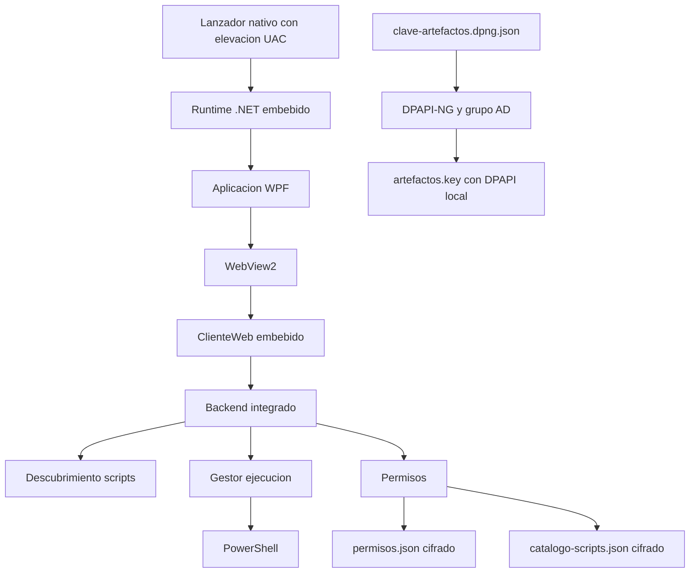

<!-- (Autor: Alex Roman) -->
<!-- Descripcion: Documentacion tecnica del lanzador de scripts PowerShell. -->

# LanzadorScripts

| Campo | Valor |
|---|---|
| Version | 1.5.0 |
| Tipo | WPF + WebView2 |
| Runtime | .NET 10 Windows x64 |
| Uso | Descubrimiento y ejecucion controlada de scripts PowerShell |
| Backend | Proceso integrado en el ejecutable |
| Configuracion | `%ProgramData%\LanzadorScripts\Usuarios\<id-SID>\configuracion.dat` |


```mermaid
flowchart TD
    A[Lanzador nativo con elevacion UAC] --> B[Runtime .NET embebido]
    B --> C[Aplicacion WPF]
    C --> D[WebView2]
    D --> E[ClienteWeb embebido]
    E --> F[Backend integrado]
    F --> G[Descubrimiento scripts]
    F --> H[Gestor ejecucion]
    F --> I[Permisos]
    H --> J[PowerShell]
    I --> K[permisos.json cifrado]
    I --> L[catalogo-scripts.json cifrado]
    M[clave-artefactos.dpng.json] --> N[DPAPI-NG y grupo AD]
    N --> O[artefactos.key con DPAPI local]
```

## Rutas

| Recurso | Ruta |
|---|---|
| Config usuario | `%ProgramData%\LanzadorScripts\Usuarios\<id-SID>\configuracion.dat` |
| Tokens admin | `%ProgramData%\LanzadorScripts\Usuarios\<id-SID>\Tokens` |
| Logs | `%ProgramData%\LanzadorScripts\Usuarios\<id-SID>\Logs` |
| Auditoria | `%ProgramData%\LanzadorScripts\Usuarios\<id-SID>\Auditoria` |
| Clave de artefactos | `%ProgramData%\LanzadorScripts\Seguridad\artefactos.key` |
| Paquete central de clave | `<RutaPermisos>\clave-artefactos.dpng.json` |
| Perfil WebView2 | `%ProgramData%\LanzadorScripts\Usuarios\<id-SID>\WebView2\Perfil-v2` |
| Temporales de proceso | `%ProgramData%\LanzadorScripts\Usuarios\<id-SID>\Temporales` |
| Aplicacion .NET interna | `%ProgramFiles%\LanzadorScripts\Aplicacion\runtime-<hash>` |
| Extraccion nativa .NET | `%ProgramFiles%\LanzadorScripts\Runtimes\DotNet\runtime-<hash>` |
| Runtime WebView2 principal | `%ProgramFiles%\LanzadorScripts\Runtimes\WebView2` |
| Staging ejecucion | `%ProgramFiles%\LanzadorScripts\Staging` |

## Configuracion

```json
{
  "RutaScripts": "\\\\MAD002MICROPRU.mad.ae.aena.es\\R$\\SCRIPS",
  "RutaPermisos": "\\\\MAD002MICROPRU.mad.ae.aena.es\\R$\\PERMISOS",
  "RutaLogs": "%ProgramData%\\\\LanzadorScripts\\\\Usuarios\\\\<id-SID>\\\\Logs",
  "MaximoEjecucionesParalelas": 5
}
```

Las rutas antiguas que apuntaban directamente a `permisos.json` se migran a la carpeta de permisos operativa.

## Publicacion

```powershell
pwsh -NoProfile -File .\Herramientas\PublicarPortable.ps1 -CertThumbprint "<THUMBPRINT>"
```

El proceso usa WebView2 Fixed Version Runtime x64 `150.0.4078.48`, valida su version, arquitectura, firma y hashes, genera un ZIP reproducible y lo embebe como recurso dentro del EXE. Tambien crea dos lanzadores nativos x64 que contienen el mismo runtime .NET firmado. Los lanzadores fijan `DOTNET_BUNDLE_EXTRACT_BASE_DIR`, `TEMP` y `TMP` antes de iniciar .NET, por lo que el proceso no depende de `%LocalAppData%\Temp\.net`. La publicacion exige `pwsh 7.6.x` y las herramientas C++ x64 de Visual Studio. No instala servicios, certificados, cuentas, tareas ni puertos en los equipos cliente.

Para firmar el EXE final, usar:

```powershell
pwsh -NoProfile -File .\Herramientas\PublicarPortable.ps1 -CertThumbprint "<THUMBPRINT>"
```

Tambien se puede usar `-CertPath` y `-CertPassword` con un certificado PFX. Si no se indica certificado, el script bloquea la publicacion salvo que se use `-AllowUnsignedForDev` para pruebas locales.

La carpeta `publicacion` contiene unicamente `LanzadorScripts.exe` y `LanzadorScripts_Portable.exe`. El primero conserva solo los runtimes actuales; el segundo elimina `%ProgramFiles%\LanzadorScripts` al salir expresamente desde la bandeja. `permisos.json`, `catalogo-scripts.json` y `clave-artefactos.dpng.json` permanecen en `\\MAD002MICROPRU.mad.ae.aena.es\R$\PERMISOS`.

El parametro `-RutaRuntimeWebView2Portable` permite usar una carpeta de Fixed Runtime ya descargada como origen local. Si no se indica, la publicacion descarga la URL oficial fijada de `150.0.4078.48`, guarda la cache en `Recursos\WebView2` y deja esa cache fuera de Git.

La inicializacion explicita de ambos archivos operativos se realiza con:

```powershell
.\Herramientas\PublicarPortable.ps1 -CertThumbprint "<THUMBPRINT>" -InicializarArtefactos
```

Antes de inicializar, la clave AES debe aprovisionarse una sola vez en el equipo administrador que publica los artefactos:

```powershell
powershell.exe -NoProfile -File .\Herramientas\AprovisionarClaveArtefactos.ps1
```

El script solicita la clave de 32 bytes en Base64 mediante entrada segura, la protege con DPAPI `LocalMachine` y aplica una ACL limitada a `SYSTEM` y `Administrators`. La clave no se acepta como argumento. Despues de generar `permisos.json` y `catalogo-scripts.json`, cree una unica copia de distribucion para un grupo de Active Directory:

```powershell
pwsh -NoProfile -File .\Herramientas\CrearPaqueteAprovisionamientoClave.ps1 `
  -GrupoDominio 'MAD00\<GRUPO_SEGURIDAD>'
```

La herramienta recupera la AES local sin recibirla por argumentos, cifra el paquete con DPAPI-NG para el SID del grupo y lo firma con el mismo certificado RSA-PSS usado por los dos artefactos. En cada equipo cliente, la aplicacion intenta leer ese paquete al arrancar, verifica las tres firmas, exige que los dos `KeyId` coincidan y guarda automaticamente `artefactos.key` con DPAPI local. Si el paquete firmado contiene una rotacion valida, reemplaza tambien una clave local antigua. El primer arranque o una rotacion necesitan acceso al recurso compartido, al dominio y al controlador de dominio. El EXE no contiene la AES ni una contraseña equivalente.

La clave se crea una sola vez en un gestor de secretos corporativo y debe ser identica en todos los equipos que lean los mismos contenedores. No genere una clave diferente para corregir el aviso en un cliente. Los dos JSON son contenedores cifrados y firmados: no se editan directamente con un editor de texto. La version 1.5.0 puede leer durante la migracion unicamente los dos contenedores v1 corporativos cuyas huellas estan fijadas en el binario; cualquier v1 distinto queda bloqueado. Toda publicacion nueva se guarda como v2 y se firma con el certificado actual. Cualquier cambio en un script exige volver a publicar el catalogo.

Los dos ejecutables finales deben ser self-contained y x64. Cada EXE exterior comprueba la huella SHA-256 del mismo componente .NET embebido, lo reutiliza solo si coincide y lo ejecuta desde `Program Files`. Si un equipo muestra un error de .NET Desktop Runtime faltante, la publicacion no es valida o se esta ejecutando un binario incorrecto.

## Ventana Y Bandeja

El lanzador nativo muestra progreso durante la validacion, extraccion e inicio, antes de que WPF pueda abrirse. La ventana WPF se muestra antes de iniciar backend y WebView2. Al minimizar permanece en la barra de tareas y en la bandeja; al cerrar o usar `Alt+F4` se oculta y los scripts siguen ejecutandose. El menu de bandeja permite restaurar, maximizar, minimizar o cerrar definitivamente. El cierre definitivo exige confirmacion y enumera los scripts que se cancelaran. Una segunda apertura del EXE restaura la instancia existente.

GitLab (`micro2822131/Lanzador-de-scrips`) y GitHub (`Eliminator-CRAK/Lanzador-de-scrips`) mantienen el mismo historial de `main`. Cada cambio se publica y verifica en ambos remotos.

Semgrep Managed Scans analiza ambos repositorios con las 2944 reglas disponibles, analisis entre archivos, Code, Supply Chain y deteccion con IA. Los flujos de GitLab y GitHub complementan esa cobertura en cada `push`, PR/MR, ejecucion manual y revision diaria con `auto`, `p/security-audit` y `p/secrets`. Como Semgrep Secrets no esta incluido en el plan actual, Gitleaks 8.30.1 revisa ademas todo el historial Git, archivos comprimidos y valores codificados. No se aplican exclusiones de `.gitignore` y los CI fallan ante cualquier hallazgo nuevo o error de configuracion.

La unica excepcion de hallazgo Semgrep corresponde a un falso positivo de baja confianza sobre `AnimatePresence` de Framer Motion en el bundle compilado. El parser actual tampoco comprende por completo cuatro archivos que usan literales raw, un constructor primario o JavaScript minificado. `Herramientas/ValidarResultadosSemgrep.py` exige que cada hallazgo, error y omision coincida con su regla o tipo, ruta, lineas y SHA-256 del contenido completo con finales de linea normalizados. Si uno de esos archivos cambia, el CI obliga a revisar de nuevo la excepcion y mantiene bloqueado cualquier problema distinto.

El workflow de publicacion en GitHub actua como respaldo para compilacion, pruebas y publicacion Windows. Sus acciones estan fijadas a commits inmutables. Instala PowerShell `7.6.0` desde la publicacion oficial, valida su SHA-256 y exige firma Authenticode en `main` mediante los secretos `WINDOWS_SIGNING_CERT_BASE64` y `WINDOWS_SIGNING_CERT_PASSWORD`.

## Recuperacion WebView2

La aplicacion extrae WebView2 Fixed Runtime x64 `150.0.4078.48` en `%ProgramFiles%\LanzadorScripts\Runtimes\WebView2\<hash-version>`. Conserva solo la version actual. La extraccion solo se reutiliza cuando coinciden el hash del ZIP, el ejecutable y la huella completa de sus 260 archivos; una copia local alterada se sustituye automaticamente. Un bloqueo explicito de WDAC o AppLocker debe autorizarse mediante la politica corporativa.

Cada extraccion concede lectura y ejecucion a `ALL APPLICATION PACKAGES` y `ALL RESTRICTED APPLICATION PACKAGES`, requeridos por el aislamiento de WebView2 Fixed Runtime. Los usuarios normales no reciben permisos de escritura sobre los binarios.

La aplicacion usa `%ProgramData%\LanzadorScripts\Usuarios\<id-SID>\WebView2\Perfil-v2` como perfil local de WebView2. El identificador se obtiene del hash completo del SID; las raices impiden que otro usuario precree carpetas. El subarbol WebView2 concede control total al SID actual para que el runtime pueda configurar las ACL de sus procesos LowIL/AppContainer, mientras administradores y sistema conservan su acceso. El perfil `Perfil` de versiones anteriores queda sin uso y no se borra automaticamente. Si el perfil falla, la aplicacion intenta recuperarlo dentro de su zona privada y, como ultimo recurso, en `C:\Windows\Temp\LanzadorScripts` sin ejecutar binarios desde esa ruta.

Antes de arrancar .NET, el lanzador nativo dirige la extraccion del bundle a `%ProgramFiles%\LanzadorScripts\Runtimes\DotNet` y los temporales a la carpeta privada del usuario en `%ProgramData%`. Ninguna de esas rutas utiliza AppData.

| Caso | Accion |
|---|---|
| Perfil recuperable | Renombra a `WebView2_Danado_yyyyMMdd_HHmmss` y crea un perfil limpio |
| Perfil bloqueado | Usa `WebView2_Recuperacion_yyyyMMdd_HHmmss` |
| Fallo de proceso Edge/WebView2 | Registra detalle en `%ProgramData%\LanzadorScripts\Usuarios\<id-SID>\Logs\arranque-yyyyMMdd.jsonl` |

Solo se conservan las ultimas 3 copias de diagnostico de perfiles dañados o de recuperacion.

## Seguridad de ejecucion

La API local exige cookie de sesion y token interno aleatorio por arranque. Los endpoints admin requieren siempre `Authorization: Bearer <token>`.

`permisos.json` y `catalogo-scripts.json` se cifran con la misma AES-256-GCM y se firman como pareja con RSA-PSS/SHA-256. El lector admite v1 solo con la clave publica historica y las huellas exactas de los dos archivos autorizados para la migracion; genera siempre v2 con el certificado actual. La clave AES se recupera de DPAPI de maquina o, si falta, del paquete central DPAPI-NG firmado. Las claves RSA privadas permanecen fuera del EXE; este incorpora unicamente los certificados o claves publicas necesarios para verificar. Si falta un archivo, no coinciden los `KeyId`, se ha manipulado una firma o Windows no autoriza la identidad, la aplicacion bloquea las ejecuciones.

La politica editable de permisos conserva solo las opciones operativas:

```json
{
  "seguridadScripts": {
    "scriptsElevadosPermitidos": [
      "admin/script.ps1"
    ],
    "permitirExecutionPolicyBypass": false
  }
}
```

La politica es fail closed. Los `.ps1`, `.bat` y `.cmd` deben figurar en el catalogo y coincidir en ruta relativa, extension, longitud y SHA-256. El lanzador valida el original y vuelve a validar la copia de staging. Los nombres con metacaracteres peligrosos se rechazan.

Los administradores publican el catalogo desde Ajustes mediante `Firmar scripts y publicar catálogo`. La operacion descubre de nuevo los archivos seleccionados y no modifica su contenido. El modo desarrollo es una excepcion administrativa limitada a la sesion.

La clave AES no esta integrada en el EXE. DPAPI-NG permite distribuirla cifrada para un grupo de Active Directory y DPAPI `LocalMachine` conserva la copia local con ACL administrativa. El EXE incorpora solo el certificado publico de verificacion; la clave RSA privada permanece en el almacen de certificados de los equipos administradores autorizados.

La aplicacion no crea tareas programadas ni registra la apertura con Windows. El operador la abre manualmente y el backend integrado toma la identidad del proceso que ha abierto la app.

El token maestro se firma con el certificado privado autorizado de Alex Roman y su generacion exige ademas una sesion de aplicacion con rol administrador y Bearer valido. El mismo token puede reutilizarse mientras se conserve protegido y la firma sea valida; no requiere motivo operativo ni se registra como usado.

Antes de ejecutar, la aplicacion valida integridad, copia el script a staging local, aplica protecciones de archivo y revalida la copia para mitigar TOCTOU.

## Pruebas

```powershell
dotnet test .\Pruebas\LanzadorScripts.Pruebas.csproj
```

## Requisitos

| Requisito | Valor |
|---|---|
| SO | Windows 10/11 Pro o Enterprise |
| PowerShell | 5.1 |
| WebView2 | Fixed Runtime x64 embebido en el EXE y autoextraido al arrancar |
| Permisos app | Ejecutable con elevacion UAC `requireAdministrator` |
| Instalacion cliente | Ninguna; copiar el EXE |
| Politicas | GPO/AppLocker/WDAC permitiendo app y `powershell.exe` |

## Manuales

- [Manual de usuario](Manual_Usuarios.md)
- [Manual de administradores y desarrolladores](Manual_Administradores_Desarrolladores.md)
