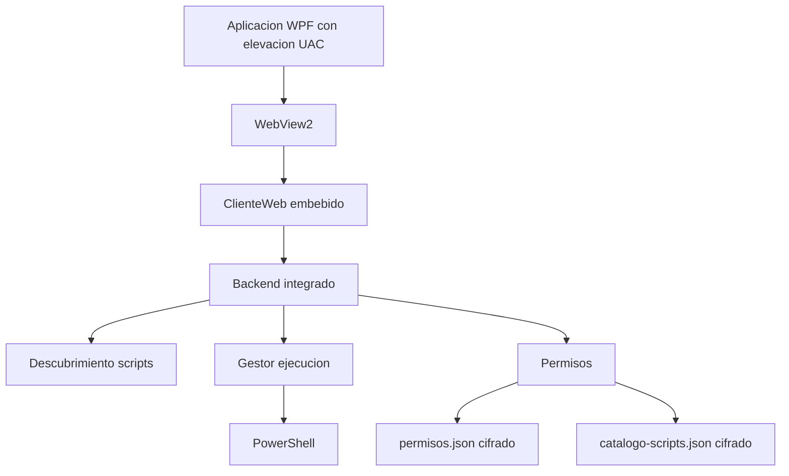

<!-- (Autor: Alex Roman) -->
<!-- Descripcion: Documentacion tecnica del lanzador de scripts PowerShell. -->

# LanzadorScripts

| Campo | Valor |
|---|---|
| Version | 1.4.1 |
| Tipo | WPF + WebView2 |
| Runtime | .NET 10 Windows x64 |
| Uso | Descubrimiento y ejecucion controlada de scripts PowerShell |
| Backend | Proceso integrado en el ejecutable |
| Configuracion | `%AppData%\LanzadorScripts\configuracion.dat` |


```mermaid
flowchart TD
    A[Aplicacion WPF con elevacion UAC] --> B[WebView2]
    B --> C[ClienteWeb embebido]
    C --> D[Backend integrado]
    D --> E[Descubrimiento scripts]
    D --> F[Gestor ejecucion]
    D --> G[Permisos]
    F --> H[PowerShell]
    G --> I[permisos.json cifrado]
    G --> J[catalogo-scripts.json cifrado]
```

## Rutas

| Recurso | Ruta |
|---|---|
| Config usuario | `%AppData%\LanzadorScripts\configuracion.dat` |
| Tokens admin | `%AppData%\LanzadorScripts\Tokens` |
| Logs | `%LocalAppData%\LanzadorScripts\Logs` |
| Auditoria | `%LocalAppData%\LanzadorScripts\Auditoria` |
| Perfil WebView2 | `%LocalAppData%\LanzadorScripts\WebView2` |
| Runtime WebView2 extraido | `%LocalAppData%\LanzadorScripts\Runtimes\WebView2` |
| Runtime WebView2 temporal | `%TEMP%\LanzadorScripts\Runtimes\WebView2` |
| Staging ejecucion | `%LocalAppData%\LanzadorScripts\Staging` |

## Configuracion

```json
{
  "RutaScripts": "\\\\MAD002MICROPRU.mad.ae.aena.es\\R$\\SCRIPS",
  "RutaPermisos": "\\\\MAD002MICROPRU.mad.ae.aena.es\\R$\\PERMISOS",
  "RutaLogs": "%LocalAppData%\\\\LanzadorScripts\\\\Logs",
  "MaximoEjecucionesParalelas": 5
}
```

Las rutas antiguas que apuntaban directamente a `permisos.json` se migran a la carpeta de permisos operativa.

## Publicacion

```powershell
pwsh -NoProfile -File .\Herramientas\PublicarPortable.ps1 -CertThumbprint "<THUMBPRINT>"
```

El proceso usa WebView2 Fixed Version Runtime x64 `150.0.4078.48`, valida su version, arquitectura, firma y hashes, genera un ZIP reproducible y lo embebe como recurso dentro del EXE. La publicacion exige `pwsh 7.6.x`. No instala runtime, servicios, certificados, cuentas, tareas ni puertos en los equipos cliente.

Para firmar el EXE final, usar:

```powershell
pwsh -NoProfile -File .\Herramientas\PublicarPortable.ps1 -CertThumbprint "<THUMBPRINT>"
```

Tambien se puede usar `-CertPath` y `-CertPassword` con un certificado PFX. Si no se indica certificado, el script bloquea la publicacion salvo que se use `-AllowUnsignedForDev` para pruebas locales.

La carpeta `publicacion` contiene unicamente `LanzadorScripts.exe`. `permisos.json` y `catalogo-scripts.json` permanecen siempre en `\\MAD002MICROPRU.mad.ae.aena.es\R$\PERMISOS`.

El parametro `-RutaRuntimeWebView2Portable` permite usar una carpeta de Fixed Runtime ya descargada como origen local. Si no se indica, la publicacion descarga la URL oficial fijada de `150.0.4078.48`, guarda la cache en `Recursos\WebView2` y deja esa cache fuera de Git.

La inicializacion explicita de ambos archivos operativos se realiza con:

```powershell
.\Herramientas\PublicarPortable.ps1 -CertThumbprint "<THUMBPRINT>" -InicializarArtefactos
```

La publicacion final debe ser self-contained, single-file y x64. Si un equipo muestra un error de .NET Desktop Runtime faltante al abrir el portable, la publicacion no es valida o se esta ejecutando un binario incorrecto.

El pipeline de GitHub exige firma Authenticode en `main` mediante los secretos `WINDOWS_SIGNING_CERT_BASE64` y `WINDOWS_SIGNING_CERT_PASSWORD`.

## Recuperacion WebView2

La aplicacion extrae WebView2 Fixed Runtime x64 `150.0.4078.48` en `%LocalAppData%\LanzadorScripts\Runtimes\WebView2\<hash-version>`. Si esa ruta no es escribible, usa `%TEMP%\LanzadorScripts\Runtimes\WebView2\<hash-version>`. La extraccion solo se reutiliza cuando coinciden el hash del ZIP, el ejecutable y la huella completa de sus 260 archivos; una copia local alterada se sustituye automaticamente. Se conservan solo la version actual y una anterior.

La aplicacion usa `%LocalAppData%\LanzadorScripts\WebView2` como perfil local de WebView2. Si el perfil falla durante el arranque, la aplicacion intenta recuperarlo automaticamente.

| Caso | Accion |
|---|---|
| Perfil recuperable | Renombra a `WebView2_Danado_yyyyMMdd_HHmmss` y crea un perfil limpio |
| Perfil bloqueado | Usa `WebView2_Recuperacion_yyyyMMdd_HHmmss` |
| Fallo de proceso Edge/WebView2 | Registra detalle en `%LocalAppData%\LanzadorScripts\Logs\arranque-yyyyMMdd.jsonl` |

Solo se conservan las ultimas 3 copias de diagnostico de perfiles dañados o de recuperacion.

## Seguridad de ejecucion

La API local exige cookie de sesion y token interno aleatorio por arranque. Los endpoints admin requieren siempre `Authorization: Bearer <token>`.

`permisos.json` y `catalogo-scripts.json` son contenedores cifrados con AES-256-GCM y firmados con RSA-PSS/SHA-256. La aplicacion construye ambos nombres dentro de la carpeta configurada y no usa copias junto al EXE. Si falta un archivo, esta manipulado o no se puede validar, la aplicacion bloquea las ejecuciones.

La politica editable de permisos conserva solo las opciones operativas:

```json
{
  "seguridadScripts": {
    "scriptsElevadosPermitidos": [
      "admin/script.ps1"
    ],
    "permitirExecutionPolicyBypass": false
  }
}
```

La politica es fail closed. Los `.ps1`, `.bat` y `.cmd` deben figurar en el catalogo y coincidir en ruta relativa, extension, longitud y SHA-256. El lanzador valida el original y vuelve a validar la copia de staging. Los nombres con metacaracteres peligrosos se rechazan.

Los administradores publican el catalogo desde Ajustes mediante `Firmar scripts y publicar catálogo`. La operacion descubre de nuevo los archivos seleccionados y no modifica su contenido. El modo desarrollo es una excepcion administrativa limitada a la sesion.

Las claves de los contenedores estan integradas en el EXE por el requisito de portabilidad. Esto oculta el contenido frente a lectura casual y detecta manipulaciones normales, pero no protege frente a un atacante capaz de extraer y reutilizar las claves del ejecutable.

La aplicacion no crea tareas programadas ni registra la apertura con Windows. El operador la abre manualmente y el backend integrado toma la identidad del proceso que ha abierto la app.

El token maestro se firma con el certificado privado autorizado de Alex Roman. El mismo token puede reutilizarse mientras se conserve protegido y la firma sea valida; no requiere motivo operativo ni se registra como usado.

Antes de ejecutar, la aplicacion valida integridad, copia el script a staging local, aplica protecciones de archivo y revalida la copia para mitigar TOCTOU.

## Pruebas

```powershell
dotnet test .\Pruebas\LanzadorScripts.Pruebas.csproj
```

## Requisitos

| Requisito | Valor |
|---|---|
| SO | Windows 10/11 Pro o Enterprise |
| PowerShell | 5.1 |
| WebView2 | Fixed Runtime x64 embebido en el EXE y autoextraido al arrancar |
| Permisos app | Ejecutable con elevacion UAC `requireAdministrator` |
| Instalacion cliente | Ninguna; copiar el EXE |
| Politicas | GPO/AppLocker/WDAC permitiendo app y `powershell.exe` |

## Manuales

- [Manual de usuario](Manual_Usuarios.md)
- [Manual de administradores y desarrolladores](Manual_Administradores_Desarrolladores.md)
